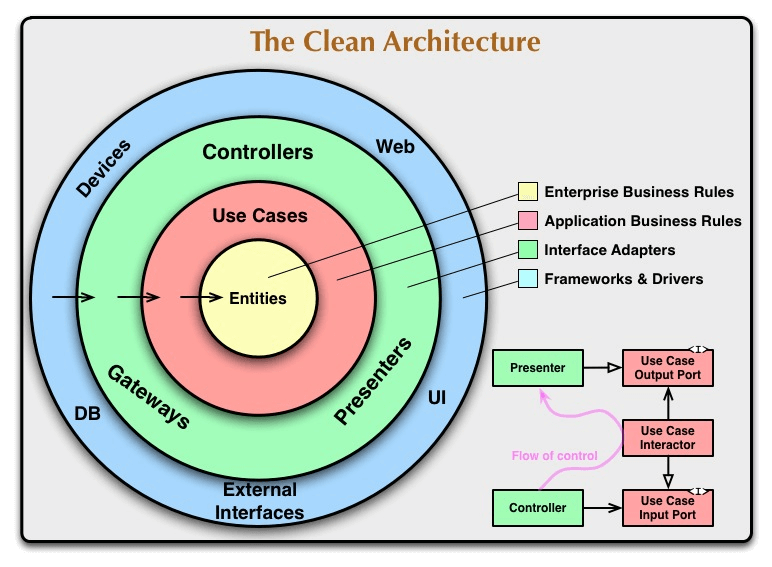

# Clean DDD Forum API

Projeto de estudo e demonstração de uma API de fórum utilizando Domain Driven Design (DDD) e Clean Architecture, com foco em organização de domínio, casos de uso, eventos e testes automatizados.

# Sumário

1. [Visão Geral](#visão-geral)
2. [Tecnologias Utilizadas](#tecnologias-utilizadas)
3. [Estrutura do Projeto](#estrutura-do-projeto)
4. [Padrões e Arquitetura](#padrões-e-arquitetura)
5. [Domínio e Conceitos DDD](#domínio-e-conceitos-ddd)
6. [Casos de Uso](#casos-de-uso)
7. [Testes](#testes)
8. [Fluxograma do App](#fluxograma-do-app)
9. [Clean Architecture](#clean-architecture)
10. [Como Clonar e Rodar o Projeto](#como-clonar-e-rodar-o-projeto)
11. [Referências e Links Úteis](#referências-e-links-úteis)

---

## Visão Geral

Projeto de estudo e demonstração de **Domain Driven Design (DDD)**, com aplicação de Clean Architecture, patterns de domínio, eventos, Pub/Sub, testes automatizados e organização modular.

---

## Tecnologias Utilizadas

- **TypeScript** — Tipagem estática e robustez.
- **Vitest** — Testes unitários e integração.
- **Vite** — Configuração de ambiente de testes.
- **ESLint + Prettier** — Padronização e qualidade de código.
- **Dayjs** — Manipulação de datas.
- **@faker-js/faker** — Geração de dados fake para testes.

---

## Estrutura do Projeto

```
src/
  core/         # Building blocks genéricos (entidades, erros, eventos, etc)
  domain/
    forum/      # Domínio principal do fórum (entidades, casos de uso, eventos)
    notification/ # Subdomínio de notificações
test/
  factories/    # Fábricas para geração de entidades fake
  repositories/ # Repositórios in-memory para testes
  utils/        # Utilitários de teste
```

### Detalhamento das principais pastas

- **src/core/**: Entidades base, erros, eventos, tipos e repositórios genéricos.
- **src/domain/forum/enterprise/entities/**: Entidades do domínio do fórum (Question, Answer, Comment, etc).
- **src/domain/forum/application/use-cases/**: Casos de uso do fórum (criar pergunta, responder, comentar, etc).
- **src/domain/forum/application/subscribers/**: Handlers de eventos de domínio.
- **src/domain/notification/**: Subdomínio de notificações, com entidades e casos de uso próprios.
- **test/**: Estrutura de testes, com mocks, fábricas e repositórios in-memory.

---

## Padrões e Arquitetura

- **Domain Driven Design (DDD)**
- **Clean Architecture**
- **Pub/Sub (Publisher/Subscriber)**
- **Aggregate Root**
- **Watched List Pattern**
- **Bounded Context**
- **Value Objects**
- **Domain Events**

Explicações detalhadas de cada pattern estão na seção [Domínio e Conceitos DDD](#domínio-e-conceitos-ddd).

---

## Domínio e Conceitos DDD

### Conceito de Pub/Sub (Publisher/Subscriber)

- Publicadores (Publishers): emitem mensagens (eventos) sem saber quem irá recebê-las.
- Assinantes (Subscribers): se inscrevem para receber mensagens de interesse.
- Uma infraestrutura intermediária (broker) faz a mediação e entrega das mensagens dos publicadores aos assinantes.

### Subdomínios

- Core: O que dá dinheiro
- Supporting: Dá suporte para o core funcionar
- Generic: Você precisa, mas não são tão importantes

#### Core
- Compra
- Catálogo
- Pagamento
- Entrega
- Faturamento

#### Supporting
- Estoque

#### Generic
- Notificação ao cliente
- Promoções
- Chat

### Aggregate

Agregado é um grupo de objetos de domínio que pertencem logicamente juntos, onde uma entidade principal (chamada de root ou raiz do agregado) controla o acesso e a integridade dos demais objetos.

### WatchedList

O padrão "Watched List" (ou Watched List Pattern) é um padrão comportamental que gerencia uma lista de objetos associados a um objeto principal, permitindo controlar e sincronizar alterações nesses objetos dependentes. Ele é comumente utilizado em sistemas onde é necessário acompanhar e aplicar mudanças em coleções de objetos relacionados, especialmente em operações de persistência ou sincronização de dados (como em ORMs, por exemplo).

### Domínio

O domínio (domain) refere-se a um conjunto de conceitos, regras, processos e comportamentos que são fundamentais para um determinado negócio ou aplicação. É a área de conhecimento que descreve e organiza todo o conhecimento e entendimento necessário para desenvolver um software que atenda às necessidades do negócio ou aplicação.

O domínio é a base do DDD e é a partir dele que os modelos de negócio são construídos. Ele é composto por um conjunto de entidades, agregados, serviços e eventos que representam conceitos fundamentais do negócio. O conhecimento do domínio é essencial para que os desenvolvedores possam entender as necessidades do negócio e construir um software que atenda a essas necessidades de forma eficiente e eficaz.

Além disso, o DDD enfatiza a importância da comunicação clara e constante entre os desenvolvedores e os especialistas do domínio (conhecidos como especialistas do domínio ou domain experts), para que o conhecimento do domínio possa ser compartilhado e incorporado ao processo de desenvolvimento de software.

### Entidades

As entidades (entities) são objetos de domínio que representam conceitos importantes do negócio. Elas são responsáveis por encapsular o estado e o comportamento relacionado a esses conceitos, e são fundamentais para a modelagem do domínio.

Uma entidade é caracterizada por ter uma identidade única e constante, que a diferencia de outras entidades do mesmo tipo.

Elas são importantes para o DDD porque elas representam as principais abstrações do domínio, e a sua correta modelagem ajuda a garantir que o software reflita de forma precisa as regras e o comportamento do negócio. Além disso, as entidades costumam ser o ponto de entrada para outras operações do sistema, como validações, cálculos e regras de negócio específicas.

### Casos de uso

Os casos de uso (use cases) são uma técnica para descrever os requisitos funcionais de um sistema. Eles descrevem uma interação específica entre o usuário e o sistema, mostrando quais ações o usuário realiza e como o sistema responde a essas ações.

Eles são uma parte importante do processo de desenvolvimento de software, pois ajudam a definir os requisitos do sistema e a garantir que ele atenda às necessidades dos usuários finais.

### Linguagem ubíqua

A linguagem ubíqua (ubiquitous language) é uma técnica que consiste em usar uma linguagem comum, compreensível tanto para desenvolvedores quanto para especialistas do domínio, para descrever e entender os conceitos e processos do domínio em questão.

Ela é importante porque ajuda a alinhar a comunicação entre os membros da equipe de desenvolvimento e os especialistas do domínio. Usando uma linguagem comum, todos os envolvidos no projeto podem ter uma compreensão compartilhada dos termos e conceitos-chave do domínio, facilitando o desenvolvimento de um software que atenda às necessidades do negócio.

Além disso, ela deve ser incorporada no código-fonte do software e em documentos relacionados, como diagramas e documentação técnica, para garantir que todos os envolvidos usem a mesma terminologia. Dessa forma, a linguagem ubíqua ajuda a garantir que o software seja construído para atender às necessidades do negócio e que todos os envolvidos no projeto estejam na mesma página.

### Agregados

Um agregado (aggregate) é um conjunto de objetos de domínio que são tratados como uma unidade coesa. Eles são usados para delimitar transações consistentes de mudança de estado dentro do domínio.

Um agregado tem uma raiz de agregado (aggregate root), que é uma única entidade que é responsável por garantir a consistência do agregado como um todo. A raiz do agregado é a única entidade que pode ser referenciada de fora do agregado. Todas as outras entidades dentro do agregado só podem ser acessadas através da raiz do agregado.

O uso deles é uma das principais técnicas para gerenciar a complexidade em sistemas de software baseados em DDD. Ao definir os limites do agregado, é possível criar um modelo de domínio mais claro e focado, com transações e responsabilidades bem definidas para cada objeto no agregado.

### Bounded Context

Bounded Context (contexto delimitado / subdomínio) é uma técnica para definir limites explícitos em torno de um conjunto de modelos de domínio. Cada Bounded Context é uma fronteira lógica que separa um modelo de domínio específico, com suas próprias regras, termos e limites, de outros modelos de domínio dentro do mesmo sistema.

Um Bounded Context pode ser visto como um subdomínio ou um setor de um sistema maior, onde as interações entre os objetos de domínio são altamente relacionadas. Dentro de um Bounded Context, as regras de negócio podem ser diferentes e podem ter nomes de entidades ou conceitos com significados distintos em outros contextos.

Essa técnica ajuda a evitar a confusão entre diferentes conceitos de negócio, evita a duplicação de código e reduz a complexidade do sistema. Cada Bounded Context pode ter sua própria arquitetura, padrões de projeto e tecnologias, permitindo que a equipe de desenvolvimento escolha as ferramentas mais adequadas para lidar com as especificidades do contexto.

Além disso, o DDD incentiva a comunicação clara e colaboração entre diferentes Bounded Contexts, por meio de integrações bem definidas e acordos claros de como os objetos de domínio serão compartilhados entre os contextos.

O estabelecimento de Bounded Contexts é uma parte importante da modelagem de um sistema baseado em DDD e deve ser conduzido em estreita colaboração entre a equipe de desenvolvimento e especialistas do domínio para garantir que as fronteiras do contexto sejam bem definidas e compreendidas.

### Value Objects

Um Value Object (objeto de valor) é uma classe que representa um valor que é importante para o domínio, mas que não possui identidade própria. Em outras palavras, um Value Object é um objeto que é definido pelos seus atributos, em vez de ser definido por uma identidade exclusiva.

Por exemplo, em um sistema de compras online, um Endereço pode ser modelado como um Value Object, pois não é importante manter um identificador único para cada endereço, mas sim os seus atributos, como rua, número, bairro, cidade, estado e CEP. Do ponto de vista do negócio, o endereço é apenas uma informação que precisa ser armazenada e consultada, não sendo uma entidade que precisa ser rastreada ou gerenciada.

Porém, é importante lembrar que nem todos os objetos sem identidade são necessariamente Value Objects. A decisão de modelar um objeto como um Value Object depende do contexto do domínio e da análise dos especialistas do negócio e da equipe de desenvolvimento.

### Eventos de domínio

Um evento de domínio (domain event) é uma notificação assíncrona que indica que algo importante aconteceu no domínio do sistema. Ele representa um fato ocorrido dentro do sistema que pode ser interessante para outras partes do sistema e pode ser usado para tomar decisões ou gerar novas ações.

Por exemplo, em um sistema de comércio eletrônico, um evento de domínio pode ser gerado quando uma nova compra é realizada com sucesso. Esse evento pode conter informações como o identificador da compra, o valor total, o endereço de entrega, entre outras informações relevantes para o domínio.

Eventos de domínio são importantes porque permitem que diferentes partes do sistema sejam notificadas e atualizadas quando ocorrem mudanças importantes no domínio. Eles também permitem que o sistema seja projetado de forma mais modular e escalável, pois diferentes partes do sistema podem ser projetadas para reagir a diferentes tipos de eventos, de forma independente.

---

## Casos de Uso

Os casos de uso estão em `src/domain/forum/application/use-cases/` e `src/domain/notification/application/use-cases/`.

Exemplos:
- Criar pergunta (`create-question.ts`)
- Responder pergunta (`answer-question.ts`)
- Comentar em pergunta/resposta
- Escolher melhor resposta
- Listar perguntas recentes
- Notificar usuário

Cada caso de uso segue o padrão de receber um input, executar regras de negócio e retornar um resultado (usando o pattern Either para sucesso/erro).

---

## Testes

- Todos os testes estão na pasta `test/` e em arquivos `.test.ts` próximos aos casos de uso.
- Utiliza **Vitest**.
- Repositórios in-memory simulam persistência.
- Fábricas (`test/factories/`) facilitam a criação de entidades fake.

### Rodando os testes

```bash
npm install
npm test
```
ou
```bash
npx vitest
```

---

## Fluxograma do App


---

## Clean Architecture

O projeto segue os princípios da Clean Architecture, separando regras de negócio do domínio, casos de uso, interfaces e infraestrutura.



---

## Como Clonar e Rodar o Projeto

```bash
git clone https://github.com/seu-usuario/clean-ddd.git
cd clean-ddd
npm install
npm test
```

---

## Referências e Links Úteis

- [Domain Driven Design](https://martinfowler.com/bliki/DomainDrivenDesign.html)
- [Clean Architecture](https://8thlight.com/blog/uncle-bob/2012/08/13/the-clean-architecture.html)
- [Vitest](https://vitest.dev/)
- [TypeScript](https://www.typescriptlang.org/)
